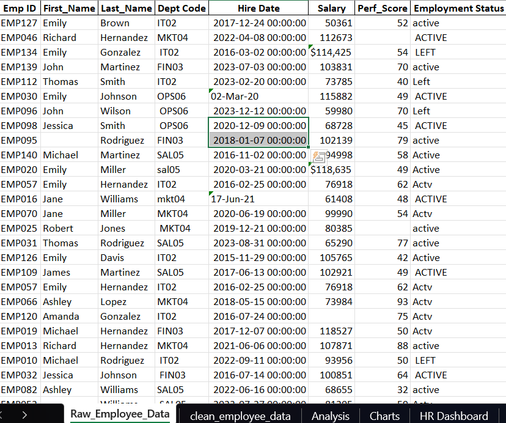
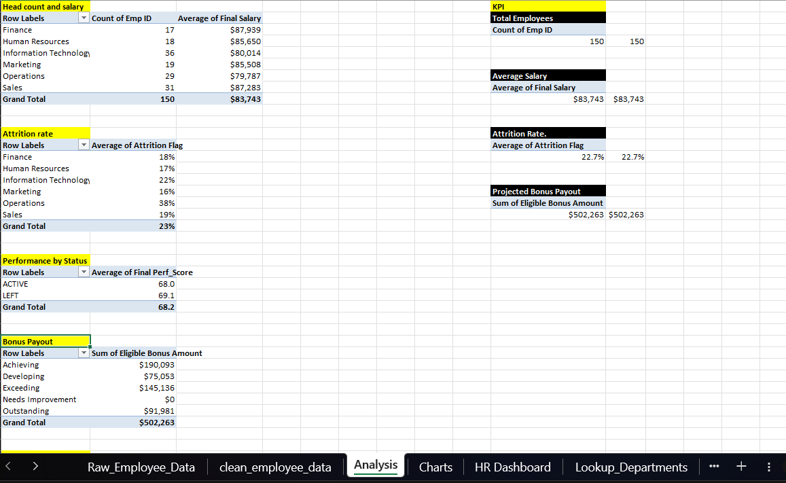
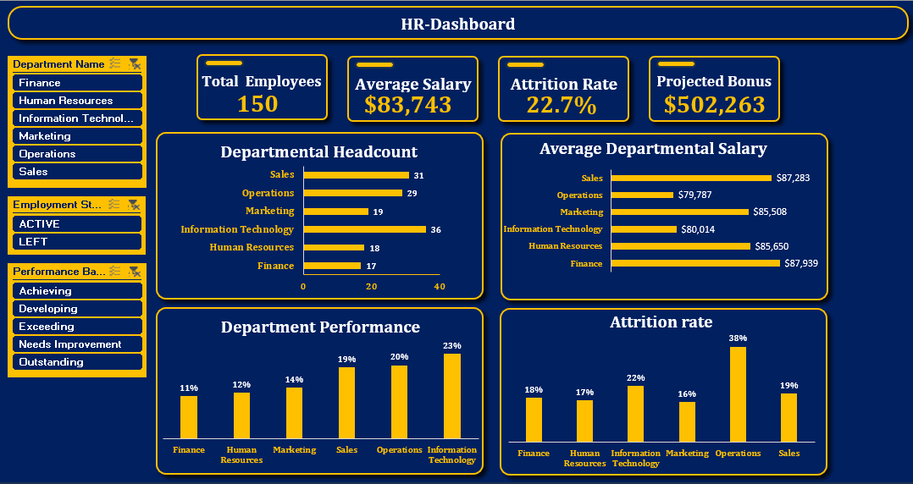

# HR Analytics Capstone Project

## Project Overview

This project focuses on cleaning, analyzing, and visualizing messy HR employee data from a legacy HR system. The HR Director needed a reliable dashboard to monitor employee headcount, salary, attrition, performance, and projected bonus payout.

The raw data had several issues, which includes:
-Duplicate employee records
-Inconsistent department codes
-Missing salary and performance scores
-Inconsistent employment status labels
-Salary values stored as text with currency symbols. 
These issues made the data unsuitable for analysis until it was cleaned and standardized.

## Raw Data Preview

---

## Tools Used

- Microsoft Excel
- Power Query
- Pivot Tables
- Pivot Charts
- Excel Formulas
- Slicers

---

## Data Cleaning Process

The data cleaning was done mainly with Power Query to make the cleaning steps repeatable and easy to track.

### 1. Removed Duplicate Records

The raw dataset contained duplicate employee records. I removed duplicates using the employee ID field because each employee should have only one unique record.

After removing duplicates, the dataset was reduced from 157 records to 150 unique employee records.

---

### 2. Cleaned Text Fields

Some text columns contained extra spaces and inconsistent formatting. I cleaned the text fields by applying trim and clean operations in Power Query.

This helped remove unnecessary spaces and hidden characters from columns such as:

- First Name
- Last Name
- Department Code
- Employment Status

This step made the data more consistent and easier to analyze.

---

### 3. Standardized Department Codes

The department code column had inconsistent formats. Some codes had lowercase letters or extra spaces.

For example:

- ` it02 `
- `sal05`
- ` HR01`

These were cleaned by trimming spaces and converting the department codes to uppercase.

After cleaning, the codes became:

- `IT02`
- `SAL05`
- `HR01`

This was important because the department codes needed to match correctly with the department lookup table.

---

### 4. Matched Department Codes with Department Names

After cleaning the department codes, I used the department lookup table to match each department code with the correct department name.

This made the analysis easier to understand because department names are more meaningful than department codes.

---

### 5. Cleaned the Salary Column

The salary column contained currency symbols and commas, which made some values behave like text instead of numbers.

For example:

`$114,425`

This was cleaned by removing the currency symbol and commas, then changing the column data type to number.

After cleaning, the value became:

`114425`

This allowed the salary column to be used correctly for calculations such as average salary and bonus amount, then I formated the final salary column back to currency after all calculations has been made.

---

### 6. Handled Missing Salary Values

Some employees had missing salary values. Instead of deleting those records, I replaced the missing salary values using the average salary of employees in the same department.

This method was used because salary is likely to vary by department. Using the department average gave a more reasonable estimate than using one general average for the entire company.

A new column called `Final Salary` was created to store the cleaned salary values.

---

### 7. Cleaned the Performance Score Column

The performance score column also had some missing values. These missing performance scores were handled using the average performance score of employees in the same department.

This helped keep the records useful for analysis instead of removing employees with missing performance data.

A new column called `Final Perf_Score` was created to store the cleaned performance scores.

---

### 8. Standardized Employment Status

The employment status column had inconsistent values such as:

- `Active`
- `active`
- `ACTIVE`
- `Actv`
- `Left`
- `Resigned`

These values were standardized into two clear categories:

- `Active`
- `Left`

Employees marked as `Resigned` were treated as `Left` because they are no longer active employees.

This cleaning step was important for calculating the attrition rate.

---

### 9. Cleaned the Hire Date Column

The hire date column was converted to a proper date format. This was necessary because the hire date was later used to calculate each employee’s years of service.

After cleaning the hire date, I used it to create a `Years of Service` column in Excel.

---

### 10. Removed Unnecessary Helper Columns

After creating the final cleaned columns, unnecessary helper columns were removed from the final output.

For example, original columns with missing or messy values and merged helper columns were removed after creating the final cleaned columns.

The final cleaned dataset kept only the useful columns needed for analysis, such as:

- Employee ID
- Full Name
- Department Name
- Hire Date
- Years of Service
- Final Salary
- Final Performance Score
- Employment Status
- Performance Band
- Eligible Bonus Amount
---

## Data Transformation

After cleaning the data, I created additional calculated columns in Excel to support the analysis.

### Full Name

The full name column was created by combining the first name and last name fields.

### Years of Service

The years of service column was calculated using the employee hire date and the current date.

### Performance Band

The performance band column was created by matching each employee’s final performance score with the performance lookup table.

### Eligible Bonus Amount

The eligible bonus amount was calculated using the employee’s final salary and the bonus percentage assigned to their performance band.

### Attrition Flag

An attrition flag was created to support attrition rate calculation.

- Active employees were assigned `0`
- Left employees were assigned `1`

The average of this flag was used to calculate the attrition rate.

---

## Exploratory Data Analysis

Pivot Tables were created to answer the following HR questions:

### 1. Headcount by Department

This analysis shows the number of employees in each department.

### 2. Average Salary by Department

This analysis shows the average salary across departments.

### 3. Attrition Rate by Department

This analysis shows the percentage of employees who left in each department.

Attrition Rate was calculated as:

`Employees who left / Total employees`

### 4. Performance by Employment Status

This analysis compares the average performance score of active employees and employees who have left.

### 5. Bonus Payout by Performance Band

This analysis shows the total projected bonus payout based on employee performance bands.

## Pivot Table Analysis

---

## Dashboard Features

The final dashboard includes:

- KPI cards for Total Employees, Average Salary, Attrition Rate, and Bonus Payout
- Charts showing headcount, salary, attrition, performance, and bonus trends
- Slicers for Department, Employment Status, and Performance Band
- Interactive filtering across the dashboard

## Dashboard Preview

---

## Key Insights

- The cleaned dataset contains 150 unique employees after duplicate records were removed.
- The overall attrition rate is 22.67%, meaning 34 out of 150 employees have left the organization.
- Operations has the highest attrition rate at 37.93%, making it the department with the biggest retention concern.
- The IT department delivers the strongest performance while receiving one of the lowest average salaries. This suggests a potential compensation imbalance that could affect employee retention if high performers are not adequately rewarded.
- Finance appears to be one of the organization's most expensive departments while contributing the weakest performance outcomes. This could indicate inefficient resource utilization or ineffective performance management.
- Employees who left had a slightly higher average performance score than active employees, showing that attrition is not limited to low-performing employees.
  
---

## Recommendations

- The HR should investigate the Operations department because it has the highest attrition rate. Since Operations also has the lowest average salary, HR should review whether compensation, workload, or career growth may be contributing to employee exits.
- The HR should review the IT department's compensation structure to ensure salaries remain competitive. Recognizing and rewarding high-performing employees can improve retention and reduce the risk of losing valuable talent.
- Retention strategies should also focus on good performers, since employees who left had a slightly higher average performance score than active employees.
- Bonus planning should focus more on the Achieving and Exceeding bands because they account for a large share of the projected payout.
- The HR should collaborate with Finance leadership to review performance expectations, employee productivity, and competency development. Additional salary increases should be linked to measurable improvements in performance.
